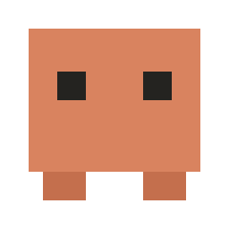

<div align="center">
  

  # clawd-pet

  A tiny pixel-art crab that lives on your Windows desktop.

  [](https://github.com/jin3107/clawd-pet/stargazers)
  [](https://github.com/jin3107/clawd-pet/network/members)
  [](LICENSE)
  [](package.json)
  [](#requirements)
  [](https://www.electronjs.org/)
</div>

<br>

It walks along the taskbar on its own, reacts to your mouse, and every so
often breaks into a trick: sits down to type on a laptop, DJs with
headphones and a turntable, heads a soccer ball, climbs up the screen and
rappels back down, surfs across the taskbar on a board, sips a cup of
coffee, or just stands there thinking. Drop it mid-air and it free-falls —
sometimes with a parachute, sometimes without.

Built with Electron: transparent, frameless, always-on-top, and click-through
except when you're actually touching the pet.

## Star History

[](https://star-history.com/#jin3107/clawd-pet&Date)

## Features

- **Autonomous wandering** — walks back and forth along the taskbar inside
  `screen.getPrimaryDisplay().workArea`, so it never overlaps the taskbar.
- **Random tricks** — walking is the default behavior; every so often it
  picks one of: `code`, `music`, `soccer`, `jump`, `climb`, `surf`, `think`,
  `coffee`.
- **Care-message bubble** — roughly once an hour, it pauses to "think" and
  pops up a small speech bubble above its head with a short check-in message
  (drink water, stretch, rest your eyes...). The bubble is its own overlay
  window, not an OS notification, so it still shows up even if system
  notifications are turned off.
- **AFK mode** — if your mouse sits still for a while, the pet wanders over
  and hangs around your cursor instead of doing its own thing.
- **Drag and drop** — click and hold the pet to pick it up, drop it anywhere
  on screen; it free-falls and settles with a bounce, sometimes popping a
  parachute on the way down.
- **Pet the head** — hover over its head to see it react happily.
- **Click-through by default** — the window only captures mouse input while
  the cursor is directly over the sprite, so it never blocks clicks on
  whatever is underneath it.

## Requirements

- Windows
- [Node.js](https://nodejs.org/) 18 or newer (20/22 LTS recommended — see the
  Node 24 note below)

## Getting started

```bash
git clone https://github.com/jin3107/clawd-pet.git
cd clawd-pet
npm install
npm start
```

A tray icon appears; right-click it and choose **Exit** to quit.

### Known issue: Node 24 + Electron install

On Node 24, `npm install`'s Electron postinstall step can silently fail to
extract `electron.exe` (you'll see only a `locales` folder under
`node_modules/electron/dist`, and `npm start` fails with "Electron failed to
install correctly"). This is an `extract-zip` incompatibility, not a network
issue — the zip is already downloaded correctly into
`%LOCALAPPDATA%\electron\Cache`.

Workarounds, in order of preference:
1. Use Node 20 or 22 LTS instead (easiest fix).
2. Or manually finish the install after `npm install`:
   ```powershell
   npm approve-scripts electron
   Expand-Archive "$env:LOCALAPPDATA\electron\Cache\<hash>\electron-v31.7.7-win32-x64.zip" -DestinationPath "node_modules\electron\dist"
   "electron.exe" | Out-File -NoNewline "node_modules\electron\path.txt"
   ```

## Building a portable .exe

```bash
npm run dist
```

Outputs a Windows installer via `electron-builder` (see the `build` section
in `package.json`).

## Project structure

```
main.js             Electron main process — window creation, movement/state
                     loop, drag/pat IPC handlers, care-message scheduling,
                     tray menu
preload.js           contextBridge: exposes petAPI to the pet renderer
bubblePreload.js      contextBridge: exposes bubbleAPI to the speech-bubble
                     overlay renderer
renderer/
  index.html          The pixel-art SVG sprite (pet)
  pet.js              Applies state classes, wires up drag/hover listeners
  bubble.html          The speech-bubble overlay window
  bubble.js           Renders bubble text, reports its size back to main
  css/
    base.css          Layout, cursors, transform origins, hidden-groups
    states.css        One body.<state> block per state/trick
    keyframes.css      All @keyframes
```

The pet's behavior is a simple state machine driven by `main.js`'s `tick()`
loop (runs every 30ms), broadcasting `{ state, facing, careMsg }` over IPC to
the renderer, which just toggles CSS classes — all animation logic lives in
`renderer/css/`. The speech bubble is a second, separate transparent
`BrowserWindow` that main.js positions above the pet's head and shows/hides
in lockstep with the `think` state.

## Contributing

Issues and pull requests are welcome — new tricks, better animations, Linux/
macOS support, whatever. A few things that help:

- Keep the sprite pixel-accurate: plain axis-aligned `<rect>` elements, no
  `rx`/rounded corners, no smooth easing on movement (use `steps(1)` for
  frame-swap style animation, not `ease-in-out`).
- New tricks go in the `tricks` array in `nextAction()` (`main.js`) plus a
  matching `body.<state>` block in `renderer/css/states.css`.
- Test by running `npm start` and actually watching the pet on your desktop
  before opening a PR — this is a visual project, screenshots/GIFs in the PR
  description help a lot.

## License

MIT — see [LICENSE](LICENSE).
